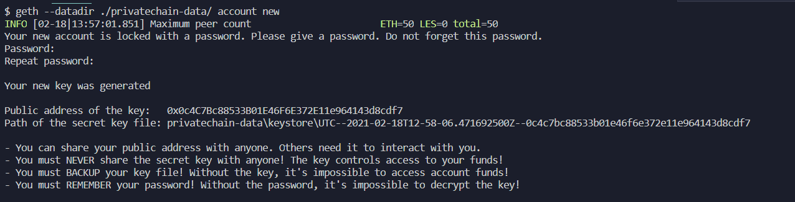
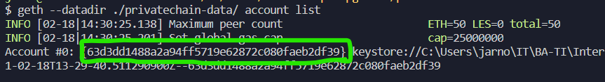

# Setup a Private Blockchain

## Table of contents:

[Run a geth node on a physical machine](#Run-a-geth-node-on-a-physical-machine)

[Run a geth node inside Docker](#Run-a-geth-node-inside-Docker)

# Run a geth node on a physical machine

In this section we will setup a Geth node by using a geth installation that is installed on our machine.

## Prerequisites

- Geth installed together with the dev-tools. [Installation](https://geth.ethereum.org/docs/install-and-build/installing-geth)

## Setup

### 1. Config file

#### General information about the config file

Firstly we will need to create a config file which will describe how the private Blockchain will look like. This will also describe the Genesis block.

> The Genesis block is the first block that will be created in a Blockchain. We will create the block later on.

You can either create this file manually or by using a tool called "Puppeth".
You can find an example of this file here `'example/genesis.json'`.

So one way to go is to copy the contents of this file into your own file.

Another way to create this file is by using the tool "Puppeth" which is included in the dev-tools when installing Geth.

#### Creation of the config file

The following steps will show you how to use Puppeth to make this configuration file.

1. Start the puppeth tool

```
$ puppeth
```

2. Then you will need to specify a network name, this can be what you want but make sure you can remember it.

```
> privatechain
```

3. Now you will get a menu with several options. Pick the one "Configure new genesis".

```
What would you like to do? (default = stats)
 1. Show network stats
 2. Configure new genesis
 3. Track new remote server
 4. Deploy network components
> 2
```

4. Now you get the option to create one from scratch or import one which is already made. We will opt to create a new one. Pick "Create new genesis from scratch".

```
What would you like to do? (default = create)
 1. Create new genesis from scratch
 2. Import already existing genesis
> 1
```

5. In this step you will get to choose which consensus engine you would like to use. This is free to choose but in our case we will go with "Ethash - proof of work".

```
Which consensus engine to use? (default = clique)
 1. Ethash - proof-of-work
 2. Clique - proof-of-authority
> 1
```

6. Next puppeth will ask you which accounts you would like to pre-fund. There is a chance that puppeth has already written `0x`, you can leave it like that and just press enter.

```
Which accounts should be pre-funded? (advisable at least one)
> 0x
```

7. After that puppeth will ask you if you want the precompile-addresses to be pre-funded with 1 Wei. Just press enter to continue.

```
Should the precompile-addresses (0x1 .. 0xff) be pre-funded with 1 wei? (advisable yes)
>
```

8. Next up it will ask you for a chain/network id. What is important here is that we use a chain/network id that is not already in use by the public Blockchains. [Here](https://besu.hyperledger.org/en/stable/Concepts/NetworkID-And-ChainID/) you can find a list of all the chain/network ids that are already taken. For example 7979 or 5222 are valid for a private Blockchain.

```
Specify your chain/network ID if you want an explicit one (default = random)
> 5222
```

Now we are done with configuring the Genesis block. The last thing we need to do is exporting this configuration.

9. If you are finished with the config you should now see a menu with almost the same options as in the beginning. Choose the option "Manage existing genesis".

```
What would you like to do? (default = stats)
 1. Show network stats
 2. Manage existing genesis
 3. Track new remote server
 4. Deploy network components
> 2
```

10. Here you will have to choose "Export genesis configurations".

```
 1. Modify existing configurations
 2. Export genesis configurations
 3. Remove genesis configuration
> 2
```

11. Right now you will be prompted where you want to save these files. In order to save the files you will need to specify a path or you can leave it blank if you want to save it in the current directory.

```
Which folder to save the genesis specs into? (default = current)
  Will create privatechain.json, privatechain-aleth.json, privatechain-harmony.json, privatechain-parity.json
>
```

12. After this the files should be created and you can quit puppeth. (In `'geth-node/config'` you can have a look at an example of those files.)

### 2. Create the Genesis block

You will notice that we have several files now. We will use the one that has just the network name in it. For example if you have entered "privatechain" when Puppeth asked for a network name then you wil see different files in your directory containing privatechain in the name of the files. We will use this one `'privatechain.json'`.

> Notice that if you entered something else when Puppeth asked for this, that you use the name that you specified before.

Here is an example if you would use a different network name when Puppeth asked for it:

```
Please specify a network name to administer (no spaces, hyphens or capital letters please):

> myprivateblockchain
```

In this case you will need to use `'myprivateblockchain.json'`.

> Note that we do not use myprivateblockchain further in the documentation but **privatechain**. This was just an example.

Command to **create** the Genesis block together with all the necessary files:

```
$ geth --datadir ./privatechain-data init privatechain.json
```

When this command is done a folder called "privatechain-data" will be created.

In this folder you can find two more folders called: `geth` & `keystore`.

`Geth` will containt all the blockchain data and `keystore` all the keys.

> In `'geth-node/data'` you have an example of the `'privatechain-data'` folder and the `'privatechain.json'` file. (The reason this folder and file is in a separate `'data'` folder is that it is easier to map this folder into a Docker container.)

### 3. Create accounts in our Blockchain

In order to do something on our Blockchain like sending transactions or mining we will need an account.

This account can receive Ether from the mining process but can also use Ether to deploy smart contracts for example.

Command to create an account:

```
$ geth --datadir ./privatechain-data account new
```

After this you will be prompted to enter a password and to re-enter this password.

> Please remember the password you used.

When this is done you will see something like this:



You will see that this command has created a file in the `'keystore'` folder.

Additionally you will see a public address of the key. This is the address of the account we just created in our Blockchain.

To see all the accounts you can use this command:

```
$ geth --datadir ./privatechain-data account list
```



In our case there will be just one address. **Copy this address because we will need it later on.**

> Not that in your case it will be a different string.

### 4. Run our first node and start mining

Before running the node you will need to create a file which will contain the password of your account you just created.

Create a file: `pwd.sec` & put your password in the file.

This is the command to run your node and immediately start mining:

```
$ geth --networkid 5333 --mine --miner.threads 1 --datadir "./privatechain-data" --nodiscover --http --http.port "8545" --port "30303" --http.corsdomain "*" --http.api="db,eth,net,personal,web3,debug,admin,miner" --unlock "address you copied" --password ./pwd.sec --allow-insecure-unlock
```

# Run a geth node inside Docker

### 1. Config file

In order to run a private Blockchain we need to describe how our Genesis block will look like.

An example of this can be found in `'example/genesis.json'`

We will use `'geth-node/data/privatechian.json'` for our Docker container.

This config file is slightly modified compared to the one in the `'example'` folder. The only real difference is the difficulty.

### 2. Run the container

Make sure you are in the `'geth-node'` folder before executing the following command.

```
$ docker-compose up
```

Now you should have a private Geth node running.

In the `'docker-compose.yml'` file you can see that there are some arguments passed to the `'run.sh'` script. Here you can change the name of the folder where the data will be stored, the name of the config file, the ports on which the services are running & the chainID number.

> The chainID number can be found in the config file, in our case here `'geth-node/data/privatechian.json'`

> Make sure that when you change the ports that you both change them in the `'- command:'` & `'- ports:'` directive in this docker-compose file.

> Also note that you have the ability to change the Golang version as well as the Geth version in the docker-compose file.
